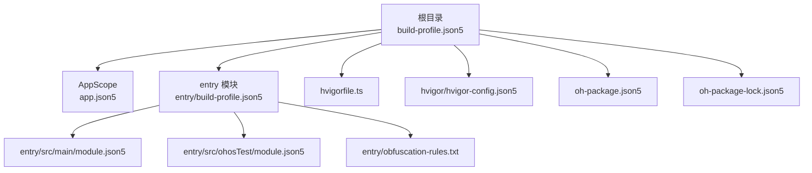
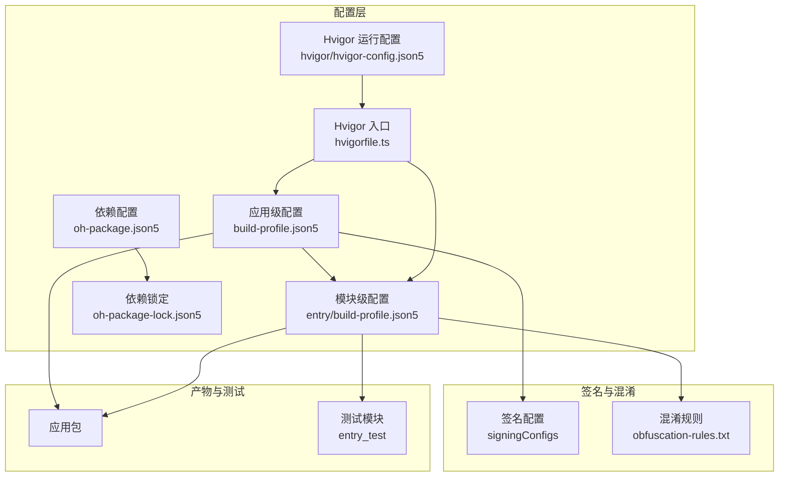
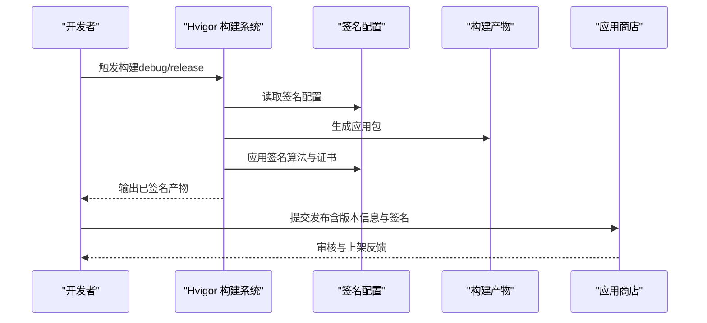
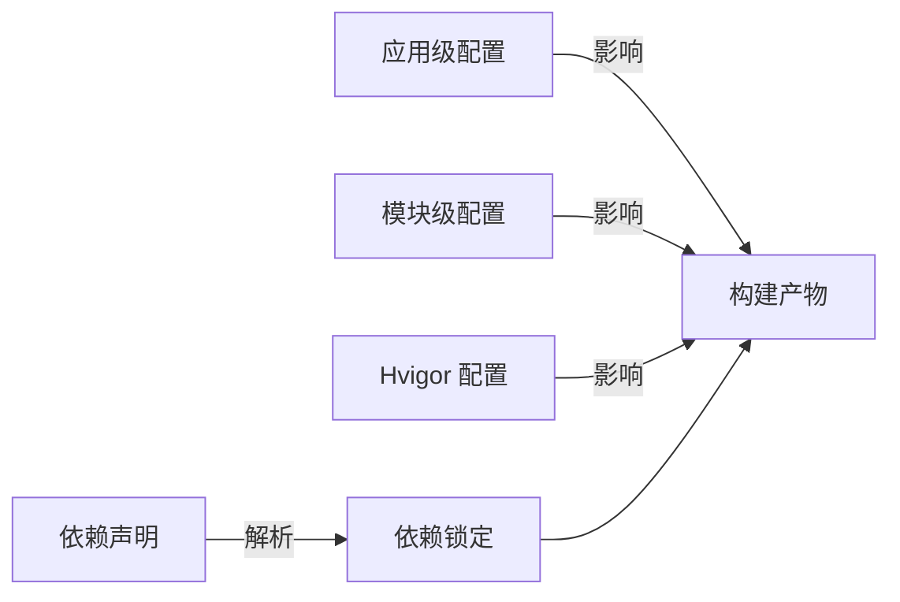

# 部署指南

<cite>
**本文引用的文件**
- [build-profile.json5](file://build-profile.json5)
- [entry/build-profile.json5](file://entry/build-profile.json5)
- [hvigorfile.ts](file://hvigorfile.ts)
- [hvigor/hvigor-config.json5](file://hvigor/hvigor-config.json5)
- [oh-package.json5](file://oh-package.json5)
- [oh-package-lock.json5](file://oh-package-lock.json5)
- [entry/obfuscation-rules.txt](file://entry/obfuscation-rules.txt)
- [AppScope/app.json5](file://AppScope/app.json5)
- [entry/src/main/module.json5](file://entry/src/main/module.json5)
- [entry/src/ohosTest/module.json5](file://entry/src/ohosTest/module.json5)
- [entry/src/test/List.test.ets](file://entry/src/test/List.test.ets)
- [entry/.gitignore](file://entry/.gitignore)
</cite>

## 目录
1. [简介](#简介)
2. [项目结构](#项目结构)
3. [核心组件](#核心组件)
4. [架构总览](#架构总览)
5. [详细组件分析](#详细组件分析)
6. [依赖分析](#依赖分析)
7. [性能考虑](#性能考虑)
8. [故障排查指南](#故障排查指南)
9. [结论](#结论)
10. [附录](#附录)

## 简介
本指南面向植物日记项目的部署与发布，覆盖构建配置、签名设置、打包与签名验证、版本发布流程、设备兼容性与质量保障、CI/CD 自动化以及应用市场发布准备与审核要点。文档基于仓库中的实际配置文件进行说明，并提供可操作的步骤与图示。

## 项目结构
项目采用多模块结构，根目录包含应用级配置与模块级配置，entry 模块为主要入口模块，包含 ArkTS 页面、模型、视图与 ViewModel，以及测试模块与资源定义。

图表来源
- [build-profile.json5:1-69](file://build-profile.json5#L1-L69)
- [entry/build-profile.json5:1-33](file://entry/build-profile.json5#L1-L33)
- [hvigorfile.ts:1-6](file://hvigorfile.ts#L1-L6)
- [hvigor/hvigor-config.json5:1-24](file://hvigor/hvigor-config.json5#L1-L24)
- [oh-package.json5:1-12](file://oh-package.json5#L1-L12)
- [oh-package-lock.json5:1-36](file://oh-package-lock.json5#L1-L36)
- [AppScope/app.json5:1-11](file://AppScope/app.json5#L1-L11)
- [entry/src/main/module.json5:1-51](file://entry/src/main/module.json5#L1-L51)
- [entry/src/ohosTest/module.json5:1-13](file://entry/src/ohosTest/module.json5#L1-L13)

章节来源
- [build-profile.json5:1-69](file://build-profile.json5#L1-L69)
- [hvigorfile.ts:1-6](file://hvigorfile.ts#L1-L6)

## 核心组件
- 应用签名配置：在应用级配置中定义了默认签名与发布签名，包含证书路径、密钥别名、算法与存储密码等信息，用于调试与发布阶段的签名。
- 构建模式：定义了 debug 与 release 两种构建模式，release 模式下可启用或关闭混淆规则。
- 模块配置：entry 模块声明了设备类型、页面、能力与扩展能力，决定安装方式与运行时行为。
- 依赖管理：通过 oh-package.json5 声明依赖与开发依赖，锁定文件确保构建一致性。
- 打包与混淆：通过 entry/obfuscation-rules.txt 定义混淆规则，配合构建配置控制是否启用混淆。

章节来源
- [build-profile.json5:1-69](file://build-profile.json5#L1-L69)
- [entry/build-profile.json5:1-33](file://entry/build-profile.json5#L1-L33)
- [entry/obfuscation-rules.txt:1-23](file://entry/obfuscation-rules.txt#L1-L23)
- [oh-package.json5:1-12](file://oh-package.json5#L1-L12)
- [oh-package-lock.json5:1-36](file://oh-package-lock.json5#L1-L36)
- [entry/src/main/module.json5:1-51](file://entry/src/main/module.json5#L1-L51)

## 架构总览
下图展示了从配置到构建产物的关键路径，包括签名、混淆、目标产物与测试模块的关系。

图表来源
- [build-profile.json5:1-69](file://build-profile.json5#L1-L69)
- [entry/build-profile.json5:1-33](file://entry/build-profile.json5#L1-L33)
- [hvigorfile.ts:1-6](file://hvigorfile.ts#L1-L6)
- [hvigor/hvigor-config.json5:1-24](file://hvigor/hvigor-config.json5#L1-L24)
- [oh-package.json5:1-12](file://oh-package.json5#L1-L12)
- [oh-package-lock.json5:1-36](file://oh-package-lock.json5#L1-L36)
- [entry/obfuscation-rules.txt:1-23](file://entry/obfuscation-rules.txt#L1-L23)

## 详细组件分析

### 构建配置与签名设置
- 应用级签名配置
  - 默认签名与发布签名分别定义，包含证书、密钥别名、签名算法与存储凭据，用于调试与发布阶段。
  - 产品配置指定目标 SDK 版本、兼容 SDK 版本与运行时 OS 类型，并开启严格模式校验。
- 模块级构建选项
  - release 构建模式下的 ArkTS 混淆规则可通过配置启用或禁用，并可引用自定义混淆规则文件。
  - 资源复制策略可在构建选项中调整，以控制资源打包行为。
- Hvigor 配置
  - 提供执行、日志、调试与 Node 选项的开关，便于在 CI/CD 中按需优化构建性能与内存占用。

章节来源
- [build-profile.json5:1-69](file://build-profile.json5#L1-L69)
- [entry/build-profile.json5:1-33](file://entry/build-profile.json5#L1-L33)
- [hvigor/hvigor-config.json5:1-24](file://hvigor/hvigor-config.json5#L1-L24)

### 设备兼容性与模块声明
- 设备类型
  - entry 模块声明支持 phone 与 tablet，确保在不同设备形态上正常安装与运行。
- 页面与能力
  - 主页面由模块配置的 pages 字段引用，能力声明包含主入口 Ability 与技能实体/动作，扩展能力包含备份扩展。
- 安装与交付
  - deliveryWithInstall 与 installationFree 控制安装交付策略与是否免安装。

章节来源
- [entry/src/main/module.json5:1-51](file://entry/src/main/module.json5#L1-L51)
- [entry/src/ohosTest/module.json5:1-13](file://entry/src/ohosTest/module.json5#L1-L13)

### 依赖与版本管理
- 依赖声明
  - 通过 oh-package.json5 声明运行依赖与开发依赖，如图表库与测试框架。
- 锁定文件
  - oh-package-lock.json5 记录解析后的依赖版本与完整性校验，确保团队与 CI 环境一致的构建结果。

章节来源
- [oh-package.json5:1-12](file://oh-package.json5#L1-L12)
- [oh-package-lock.json5:1-36](file://oh-package-lock.json5#L1-L36)

### 构建流程与产物
- 构建入口
  - hvigorfile.ts 指向内置的 appTasks，作为构建系统的核心任务入口。
- 构建模式
  - 根配置定义 debug 与 release 两种模式；模块配置中 release 模式可控制 ArkTS 混淆规则。
- 测试模块
  - entry_test 模块与测试入口文件用于本地单元测试集合。

章节来源
- [hvigorfile.ts:1-6](file://hvigorfile.ts#L1-L6)
- [entry/build-profile.json5:1-33](file://entry/build-profile.json5#L1-L33)
- [entry/src/test/List.test.ets:1-5](file://entry/src/test/List.test.ets#L1-L5)

### 签名验证与混淆规则
- 签名材料
  - 签名配置包含证书路径、密钥别名、签名算法与存储凭据，确保应用签名一致性与可验证性。
- 混淆规则
  - obfuscation-rules.txt 定义属性、全局、文件名与导出等混淆策略，模块配置中可启用或禁用混淆并引用该规则文件。

章节来源
- [build-profile.json5:1-69](file://build-profile.json5#L1-L69)
- [entry/obfuscation-rules.txt:1-23](file://entry/obfuscation-rules.txt#L1-L23)
- [entry/build-profile.json5:1-33](file://entry/build-profile.json5#L1-L33)

### 不同环境的构建配置差异
- 开发环境（debug）
  - 使用默认签名，构建严格模式开启敏感检查与规范化 URL 处理，便于早期发现配置问题。
- 生产环境（release）
  - 可选择启用混淆规则以提升代码安全性与减小体积，同时保持签名配置与 SDK 版本一致。
- 模块差异化
  - release 模式下可独立控制 ArkTS 混淆开关与规则文件引用，满足不同模块的差异化需求。

章节来源
- [build-profile.json5:1-69](file://build-profile.json5#L1-L69)
- [entry/build-profile.json5:1-33](file://entry/build-profile.json5#L1-L33)

### 打包、签名验证与版本发布流程
- 打包流程
  - 通过 Hvigor 构建系统读取应用与模块配置，生成对应构建模式的产物。
- 签名验证
  - 使用签名配置中的证书与密钥对产物进行签名，确保应用可被设备识别与安装。
- 版本发布
  - 应用版本号与名称在 AppScope 的 app.json5 中定义，发布前应核对版本信息与签名状态。

图表来源
- [build-profile.json5:1-69](file://build-profile.json5#L1-L69)
- [hvigorfile.ts:1-6](file://hvigorfile.ts#L1-L6)
- [AppScope/app.json5:1-11](file://AppScope/app.json5#L1-L11)

## 依赖分析
- 组件耦合
  - 应用级配置与模块级配置共同决定构建行为与产物特性。
  - Hvigor 配置影响构建性能与日志级别，适合在 CI/CD 中按需调优。
- 外部依赖
  - 通过 oh-package.json5 与 oh-package-lock.json5 管理第三方依赖，确保一致性与可复现性。

图表来源
- [build-profile.json5:1-69](file://build-profile.json5#L1-L69)
- [entry/build-profile.json5:1-33](file://entry/build-profile.json5#L1-L33)
- [hvigor/hvigor-config.json5:1-24](file://hvigor/hvigor-config.json5#L1-L24)
- [oh-package.json5:1-12](file://oh-package.json5#L1-L12)
- [oh-package-lock.json5:1-36](file://oh-package-lock.json5#L1-L36)

章节来源
- [oh-package.json5:1-12](file://oh-package.json5#L1-L12)
- [oh-package-lock.json5:1-36](file://oh-package-lock.json5#L1-L36)

## 性能考虑
- 构建性能
  - 在 Hvigor 配置中可启用并行编译、增量编译与守护进程，以缩短构建时间。
- 内存与日志
  - 合理设置 Node 最大堆大小与日志级别，避免 CI 环境资源不足。
- 混淆策略
  - 在 release 模式下谨慎启用混淆，平衡安全与可维护性；必要时使用规则文件进行精细化控制。

章节来源
- [hvigor/hvigor-config.json5:1-24](file://hvigor/hvigor-config.json5#L1-L24)
- [entry/build-profile.json5:1-33](file://entry/build-profile.json5#L1-L33)
- [entry/obfuscation-rules.txt:1-23](file://entry/obfuscation-rules.txt#L1-L23)

## 故障排查指南
- 构建失败
  - 检查 Hvigor 配置中的并行与增量编译设置，确认 Node 内存上限是否足够。
- 签名错误
  - 确认签名配置中的证书路径、密钥别名与存储凭据正确无误，避免路径大小写与转义问题。
- 依赖不一致
  - 使用 oh-package-lock.json5 校验依赖版本，避免本地与 CI 环境差异导致的构建异常。
- 忽略目录
  - entry/.gitignore 中包含构建产物与缓存目录，确保这些目录不会被提交到版本控制。

章节来源
- [hvigor/hvigor-config.json5:1-24](file://hvigor/hvigor-config.json5#L1-L24)
- [build-profile.json5:1-69](file://build-profile.json5#L1-L69)
- [oh-package-lock.json5:1-36](file://oh-package-lock.json5#L1-L36)
- [entry/.gitignore:1-6](file://entry/.gitignore#L1-L6)

## 结论
本部署指南基于仓库现有配置，明确了构建、签名、混淆与发布的整体流程，并提供了针对不同环境的配置差异说明。建议在 CI/CD 中固化 Hvigor 配置与依赖锁定，确保构建稳定性与可重复性；发布前严格核对签名与版本信息，满足应用市场的审核要求。

## 附录
- CI/CD 自动化建议
  - 在流水线中固定 Node 版本与 Hvigor 配置，优先使用 oh-package-lock.json5 进行依赖安装。
  - 分阶段执行：安装依赖 → 构建 debug 产物 → 单元测试 → 构建 release 产物 → 签名 → 上传制品。
- 应用市场发布准备清单
  - 确认 AppScope 的应用包名、版本号与图标符合平台规范。
  - 准备隐私政策与用户协议链接，确保应用具备必要的合规信息。
  - 对照设备类型声明进行兼容性测试，覆盖 phone 与 tablet 场景。
- 质量保证要求
  - 引入单元测试与集成测试，结合覆盖率报告评估测试质量。
  - 在 release 构建中启用混淆并进行回归测试，确保功能与性能稳定。