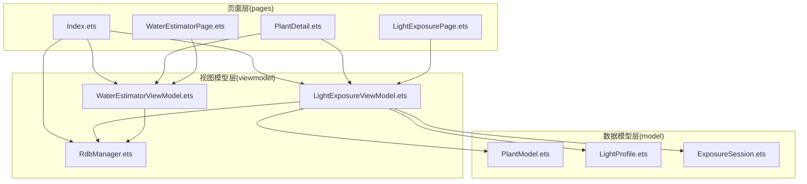
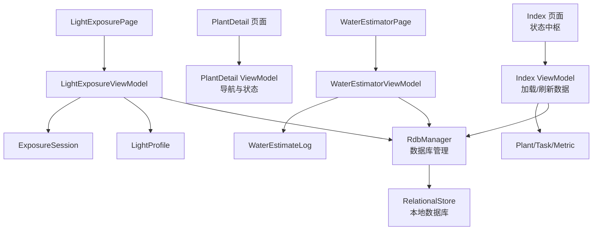
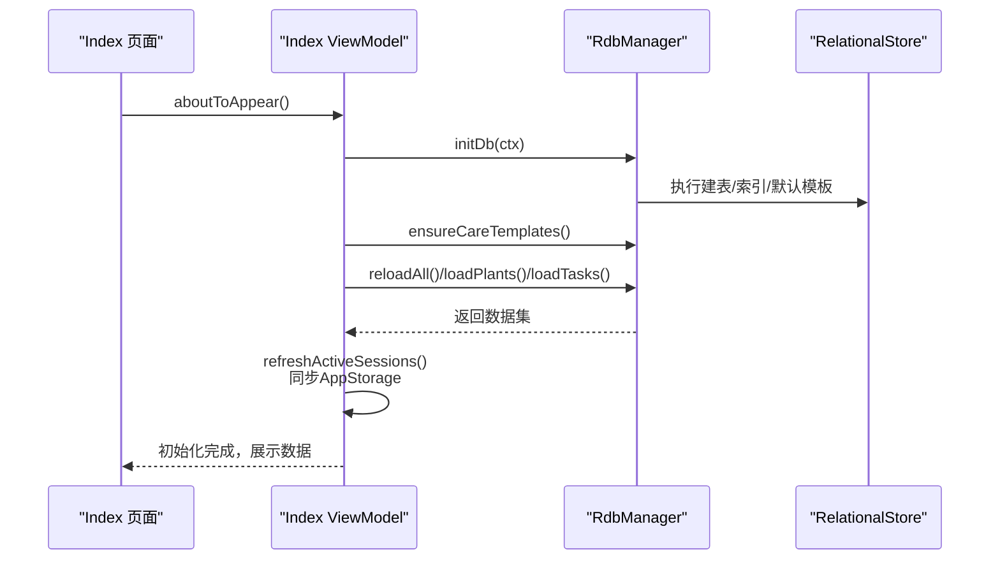
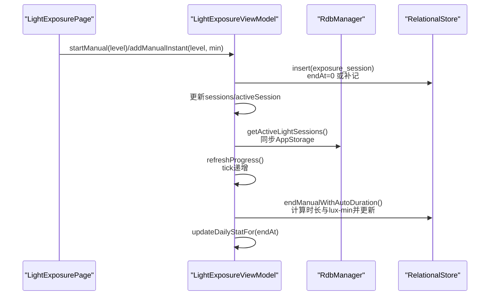
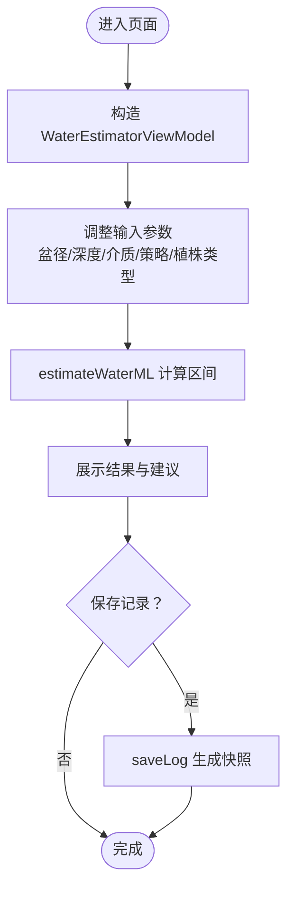
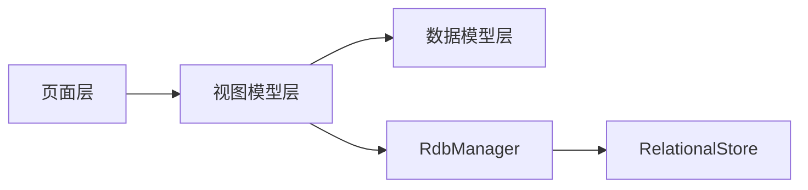

# 项目概述

<cite>
**本文引用的文件**
- [PROJECT_GUIDE.md](file://PROJECT_GUIDE.md)
- [Index.ets](file://entry/src/main/ets/pages/Index.ets)
- [PlantDetail.ets](file://entry/src/main/ets/pages/PlantDetail.ets)
- [RdbManager.ets](file://entry/src/main/ets/viewmodel/RdbManager.ets)
- [PlantModel.ets](file://entry/src/main/ets/model/PlantModel.ets)
- [LightExposureViewModel.ets](file://entry/src/main/ets/viewmodel/LightExposureViewModel.ets)
- [WaterEstimatorViewModel.ets](file://entry/src/main/ets/viewmodel/WaterEstimatorViewModel.ets)
- [LightExposurePage.ets](file://entry/src/main/ets/pages/LightExposurePage.ets)
- [WaterEstimatorPage.ets](file://entry/src/main/ets/pages/WaterEstimatorPage.ets)
- [LightProfile.ets](file://entry/src/main/ets/model/LightProfile.ets)
- [ExposureSession.ets](file://entry/src/main/ets/model/ExposureSession.ets)
- [module.json5](file://entry/src/main/module.json5)
- [build-profile.json5](file://entry/build-profile.json5)
- [main_pages.json](file://entry/src/main/resources/base/profile/main_pages.json)
</cite>

## 目录
1. [简介](#简介)
2. [项目结构](#项目结构)
3. [核心组件](#核心组件)
4. [架构总览](#架构总览)
5. [详细组件分析](#详细组件分析)
6. [依赖关系分析](#依赖关系分析)
7. [性能考量](#性能考量)
8. [故障排查指南](#故障排查指南)
9. [结论](#结论)
10. [附录](#附录)

## 简介
植物日记是一个基于 HarmonyOS 5.0.5 与 ArkTS 开发的植物养护管理应用，采用 MVVM 架构模式，围绕植物信息管理、光照记录、浇水估算、生长指标跟踪等核心功能构建。项目通过响应式状态管理与轻量数据模型，实现跨页面共享状态、实时数据更新与本地数据库持久化，帮助用户科学、系统地管理植物日常养护。

- 目标用户：居家植物爱好者、新手园艺玩家、关注植物健康的用户
- 应用场景：日常光照监测、浇水决策辅助、生长趋势追踪、应急与轮换提醒
- 技术优势：HarmonyOS 平台原生体验、ArkTS 响应式开发、ArkUI 组件生态、RelationalStore 本地数据库

## 项目结构
项目采用“页面层 + 视图模型层 + 数据模型层 + 基础组件 + 应用入口”的分层组织方式，目录结构清晰，职责边界明确：

- entry/src/main/ets/pages：页面层，承载各功能页面与导航
- entry/src/main/ets/viewmodel：业务逻辑层，封装 ViewModel 与数据库管理
- entry/src/main/ets/model：数据模型层，定义轻量数据结构与业务实体
- entry/src/main/ets/view：可复用 UI 组件
- entry/src/main/ets/component：基础组件
- entry/src/main/module.json5：模块能力与页面配置
- entry/build-profile.json5：构建与发布配置

**图表来源**
- [Index.ets:1-1382](file://entry/src/main/ets/pages/Index.ets#L1-L1382)
- [PlantDetail.ets:1-136](file://entry/src/main/ets/pages/PlantDetail.ets#L1-L136)
- [LightExposurePage.ets:1-806](file://entry/src/main/ets/pages/LightExposurePage.ets#L1-L806)
- [WaterEstimatorPage.ets:1-490](file://entry/src/main/ets/pages/WaterEstimatorPage.ets#L1-L490)
- [RdbManager.ets:1-296](file://entry/src/main/ets/viewmodel/RdbManager.ets#L1-L296)
- [LightExposureViewModel.ets:1-554](file://entry/src/main/ets/viewmodel/LightExposureViewModel.ets#L1-L554)
- [WaterEstimatorViewModel.ets:1-130](file://entry/src/main/ets/viewmodel/WaterEstimatorViewModel.ets#L1-L130)
- [PlantModel.ets:1-166](file://entry/src/main/ets/model/PlantModel.ets#L1-L166)
- [LightProfile.ets:1-41](file://entry/src/main/ets/model/LightProfile.ets#L1-L41)
- [ExposureSession.ets:1-84](file://entry/src/main/ets/model/ExposureSession.ets#L1-L84)

**章节来源**
- [PROJECT_GUIDE.md:9-38](file://PROJECT_GUIDE.md#L9-L38)
- [module.json5:1-51](file://entry/src/main/module.json5#L1-L51)
- [build-profile.json5:1-33](file://entry/build-profile.json5#L1-L33)
- [main_pages.json:1-6](file://entry/src/main/resources/base/profile/main_pages.json#L1-L6)

## 核心组件
- 数据模型层（Model）
  - 植物、任务、日志、指标等轻量数据结构，使用响应式装饰器实现状态追踪与自动更新
  - 示例：Plant、PlanTpl、PlantTask、Metric、LogEntry、PlantMetric 等
- 视图模型层（ViewModel）
  - LightExposureViewModel：光照记录与统计，支持开始/结束光照、手动补记、实时达标率与七日统计
  - WaterEstimatorViewModel：浇水估算，输入盆径、深度、介质、策略、植株类型，输出推荐区间与建议
  - RdbManager：数据库初始化、建表与索引、默认模板数据注入、查询活跃光照会话
- 页面层（Pages）
  - Index：应用入口与状态中枢，统一加载植物、任务、模板与指标数据，协调全局状态
  - PlantDetail：植物详情与快捷功能入口
  - LightExposurePage：光照记录页面，包含环形进度、状态卡片、偏好配置与历史记录
  - WaterEstimatorPage：浇水估算页面，包含尺寸调节、参数选择、结果展示与记录保存

**章节来源**
- [PROJECT_GUIDE.md:40-82](file://PROJECT_GUIDE.md#L40-L82)
- [PlantModel.ets:1-166](file://entry/src/main/ets/model/PlantModel.ets#L1-L166)
- [LightExposureViewModel.ets:1-554](file://entry/src/main/ets/viewmodel/LightExposureViewModel.ets#L1-L554)
- [WaterEstimatorViewModel.ets:1-130](file://entry/src/main/ets/viewmodel/WaterEstimatorViewModel.ets#L1-L130)
- [RdbManager.ets:1-296](file://entry/src/main/ets/viewmodel/RdbManager.ets#L1-L296)
- [Index.ets:1-1382](file://entry/src/main/ets/pages/Index.ets#L1-L1382)
- [PlantDetail.ets:1-136](file://entry/src/main/ets/pages/PlantDetail.ets#L1-L136)
- [LightExposurePage.ets:1-806](file://entry/src/main/ets/pages/LightExposurePage.ets#L1-L806)
- [WaterEstimatorPage.ets:1-490](file://entry/src/main/ets/pages/WaterEstimatorPage.ets#L1-L490)

## 架构总览
项目采用 MVVM 架构，页面仅负责 UI 呈现与事件绑定，业务逻辑集中在 ViewModel，数据持久化由 RdbManager 统一封装，数据模型通过响应式装饰器实现自动更新。

**图表来源**
- [Index.ets:1-1382](file://entry/src/main/ets/pages/Index.ets#L1-L1382)
- [PlantDetail.ets:1-136](file://entry/src/main/ets/pages/PlantDetail.ets#L1-L136)
- [LightExposurePage.ets:1-806](file://entry/src/main/ets/pages/LightExposurePage.ets#L1-L806)
- [WaterEstimatorPage.ets:1-490](file://entry/src/main/ets/pages/WaterEstimatorPage.ets#L1-L490)
- [LightExposureViewModel.ets:1-554](file://entry/src/main/ets/viewmodel/LightExposureViewModel.ets#L1-L554)
- [WaterEstimatorViewModel.ets:1-130](file://entry/src/main/ets/viewmodel/WaterEstimatorViewModel.ets#L1-L130)
- [RdbManager.ets:1-296](file://entry/src/main/ets/viewmodel/RdbManager.ets#L1-L296)
- [PlantModel.ets:1-166](file://entry/src/main/ets/model/PlantModel.ets#L1-L166)
- [LightProfile.ets:1-41](file://entry/src/main/ets/model/LightProfile.ets#L1-L41)
- [ExposureSession.ets:1-84](file://entry/src/main/ets/model/ExposureSession.ets#L1-L84)

## 详细组件分析

### 数据库与状态中枢（Index 页面）
- 职责：初始化数据库、加载植物/任务/模板/指标数据、统一刷新全局状态、提供横幅提示与导航栈
- 关键流程：aboutToAppear 生命周期中调用 RdbManager 初始化，随后一次性加载植物与任务，刷新光照活动状态映射到 AppStorage，便于首页卡片实时显示

**图表来源**
- [Index.ets:116-168](file://entry/src/main/ets/pages/Index.ets#L116-L168)
- [RdbManager.ets:27-170](file://entry/src/main/ets/viewmodel/RdbManager.ets#L27-L170)

**章节来源**
- [Index.ets:116-168](file://entry/src/main/ets/pages/Index.ets#L116-L168)
- [RdbManager.ets:27-170](file://entry/src/main/ets/viewmodel/RdbManager.ets#L27-L170)

### 光照记录（LightExposureViewModel 与 LightExposurePage）
- 核心能力
  - 开始/结束光照会话：自动计算时长与等效光照量（lux-min），更新进行中状态与 AppStorage
  - 手动补记：直接输入光照时长，立即落库并更新统计
  - 实时达标率与状态：基于目标上限与当前累计值计算百分比与状态（不足/适中/过强）
  - 七日统计：按日聚合光照量，支持今天叠加进行中会话的实时值
  - 偏好配置：目标下限/上限与偏好光照级别，自动建议与快速调整
- 关键流程：页面 onReady 接收植物参数，构造 ViewModel 并 init；定时器每秒刷新 tick，驱动进行中进度与达标率实时更新

**图表来源**
- [LightExposurePage.ets:229-241](file://entry/src/main/ets/pages/LightExposurePage.ets#L229-L241)
- [LightExposureViewModel.ets:129-192](file://entry/src/main/ets/viewmodel/LightExposureViewModel.ets#L129-L192)
- [RdbManager.ets:278-294](file://entry/src/main/ets/viewmodel/RdbManager.ets#L278-L294)

**章节来源**
- [LightExposureViewModel.ets:1-554](file://entry/src/main/ets/viewmodel/LightExposureViewModel.ets#L1-L554)
- [LightExposurePage.ets:1-806](file://entry/src/main/ets/pages/LightExposurePage.ets#L1-L806)
- [LightProfile.ets:1-41](file://entry/src/main/ets/model/LightProfile.ets#L1-L41)
- [ExposureSession.ets:1-84](file://entry/src/main/ets/model/ExposureSession.ets#L1-L84)

### 浇水估算（WaterEstimatorViewModel 与 WaterEstimatorPage）
- 核心能力
  - 输入参数：盆径、深度、介质类型、浇水策略、植物类型
  - 计算结果：低/中/高区间（ml），并提供建议文案与简要公式说明
  - 历史记录：保存估算快照（含输入与结果），支持备注与查看
- 关键流程：页面进入时根据植物 ID 构造 ViewModel；任一输入变化自动重算；支持保存记录与直接用推荐值记一笔浇水

**图表来源**
- [WaterEstimatorPage.ets:15-22](file://entry/src/main/ets/pages/WaterEstimatorPage.ets#L15-L22)
- [WaterEstimatorViewModel.ets:74-123](file://entry/src/main/ets/viewmodel/WaterEstimatorViewModel.ets#L74-L123)

**章节来源**
- [WaterEstimatorViewModel.ets:1-130](file://entry/src/main/ets/viewmodel/WaterEstimatorViewModel.ets#L1-L130)
- [WaterEstimatorPage.ets:1-490](file://entry/src/main/ets/pages/WaterEstimatorPage.ets#L1-L490)

### 数据模型与状态装饰器
- 数据模型：Plant、PlanTpl、PlantTask、Metric、LogEntry、PlantMetric 等，均使用响应式装饰器，支持细粒度状态追踪
- 状态装饰器：@State、@Prop、@Link、@Local、@Consumer、@ObservedV2、@Trace，实现组件内外部状态的声明式管理

**章节来源**
- [PlantModel.ets:1-166](file://entry/src/main/ets/model/PlantModel.ets#L1-L166)
- [PROJECT_GUIDE.md:71-82](file://PROJECT_GUIDE.md#L71-L82)

## 依赖关系分析
- 页面与 ViewModel：页面通过 ViewModel 聚合业务逻辑，避免直接访问数据库
- ViewModel 与数据库：RdbManager 统一建表、索引与默认数据，提供 CRUD 与查询能力
- 数据模型与 ViewModel：模型定义轻量数据结构，ViewModel 负责业务规则与持久化
- 页面与导航：Index 作为状态中枢，PlantDetail 提供快捷入口，页面间通过 NavPathStack 导航

**图表来源**
- [Index.ets:1-1382](file://entry/src/main/ets/pages/Index.ets#L1-L1382)
- [LightExposurePage.ets:1-806](file://entry/src/main/ets/pages/LightExposurePage.ets#L1-L806)
- [WaterEstimatorPage.ets:1-490](file://entry/src/main/ets/pages/WaterEstimatorPage.ets#L1-L490)
- [LightExposureViewModel.ets:1-554](file://entry/src/main/ets/viewmodel/LightExposureViewModel.ets#L1-L554)
- [WaterEstimatorViewModel.ets:1-130](file://entry/src/main/ets/viewmodel/WaterEstimatorViewModel.ets#L1-L130)
- [RdbManager.ets:1-296](file://entry/src/main/ets/viewmodel/RdbManager.ets#L1-L296)

**章节来源**
- [module.json5:1-51](file://entry/src/main/module.json5#L1-L51)
- [main_pages.json:1-6](file://entry/src/main/resources/base/profile/main_pages.json#L1-L6)

## 性能考量
- 避免在 build 中执行复杂计算，减少不必要的重渲染
- 使用 @ObservedV2 精准追踪数据变化，降低响应式更新成本
- 列表使用惰性渲染与合适布局，必要时采用懒加载
- 数据库查询建立复合索引，如任务按 plantId+createdAt、指标按 plantId+createdAt，提升查询效率
- ViewModel 增量更新统计，避免全量扫描历史

[本节为通用指导，无需列出具体文件来源]

## 故障排查指南
- 数据库初始化失败：检查 RdbManager 初始化流程与权限配置
- 页面间参数传递：确认使用 @Param 接收参数与 NavPathStack 导航
- 实时数据更新：确保使用 @Trace 装饰器并在 ViewModel 中触发响应式更新
- 光照会话异常：当存在多个进行中会话时，ViewModel 会强制结束异常会话并同步 AppStorage

**章节来源**
- [Index.ets:116-125](file://entry/src/main/ets/pages/Index.ets#L116-L125)
- [LightExposureViewModel.ets:90-113](file://entry/src/main/ets/viewmodel/LightExposureViewModel.ets#L90-L113)
- [PROJECT_GUIDE.md:233-243](file://PROJECT_GUIDE.md#L233-L243)

## 结论
植物日记项目以 MVVM 架构为核心，结合 ArkTS 响应式特性与 HarmonyOS 平台优势，实现了从植物信息管理到光照记录、浇水估算与生长指标跟踪的完整闭环。通过统一的状态中枢与数据库管理，项目在用户体验与开发效率之间取得平衡，既适合初学者快速上手，也为有经验的开发者提供了清晰的扩展路径。

[本节为总结性内容，无需列出具体文件来源]

## 附录
- 开发建议：新增功能遵循 model → viewmodel → page → index 注册的步骤
- 调试技巧：使用 hilog、console、prompt 进行日志与提示输出
- 学习资源：HarmonyOS 官方文档、ArkTS 语言基础、ArkUI 组件参考

**章节来源**
- [PROJECT_GUIDE.md:206-232](file://PROJECT_GUIDE.md#L206-L232)